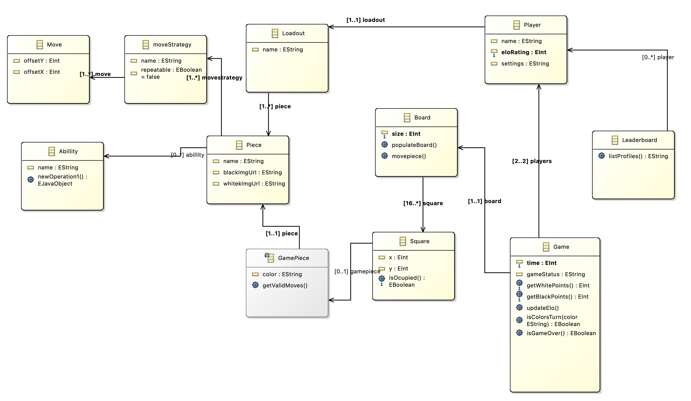

# Todos:
- Lage meta modellen
     - Lage operations
     - Lage associations
     - Lage attributes
     - Lage constraints
     - Lage derived properties
- Utvide modellen
- Få .editor til å fungere
- Lage dynamic instances (scripting?) (kanskje ikke)


# Ideer:
- Abstrakte klasser
     - Mulig på pieces (at hver brikke kan ha en klasse)
     - Mulig på loadouts (at hver loadout er en egen klasse)
     - Mulig på player (at hver spiller har en egen klasse)

# Utvidelse ideer:
- Height og width på board
- Abillities til pieces
- Flere spillere
- Spiller kan være med på flere spill samtidig

# Andre notes:
- Ikke sjakk eller sjakkmatt logikk  (vanskelig å autogenerere)
- Ha en operation som sjekker om kongen eksisterer for å sjekke om gamet er over


# Link to main project 

[GitLab repo](https://gitlab.stud.idi.ntnu.no/sandesl/chess2)

[Link inside repo to relevant files](https://gitlab.stud.idi.ntnu.no/sandesl/chess2/-/tree/main/core/src/com/mygdx/game/model)


# Chess Evolution Ecore Model

This repository contains the Ecore model and related files for the Chess Evolution project, an innovative take on the classic game of chess with enhanced features and variability aspects.

## Repository Structure

```
/Assignment2
│
├── /model
│   ├── assignment2.ecore           # The Ecore model defining the domain concepts
│   ├── assignment2.genmodel        # The GenModel file for generating Java code
│   └── assignment2.aird            # The AIRD file for generating Java code
│
├── /src-gen
│   ├── /impl 
│   │   ├── ...                     # Generated Java implementation classes
│   │
│   ├── /util
│   │   ├── ...                     # Generated Java utility classes
│   │ 
│   ├── /Assignment2Factory.java    # Generated Java factory class
│   ├── /Assignment2Package.java    # Generated Java package class
│   ├── /Board.java                 # EClass for Board
│   ├── /Square.java                # EClass for Square
│   ├── /Game.java                  # EClass for Game
│   ├── /GamePiece.java             # EClass for GamePiece
│   ├── /Leaderboard.java           # EClass for Leaderboard
│   ├── /Position.java              # EClass for Position
│   ├── /Loadout.java               # EClass for Loadout
│   ├── /Piece.java                 # EClass for Piece
│   ├── /Player.java                # EClass for Player
│   └── /Profile.java               # EClass for Profile
│
├── /instances
│   ├── GamePiece.xmi               # Example model instances of a GamePiece
│   ├── Loadout.xmi                 # Example model instances of a Loadout
│   ├── Piece.xmi                   # Example model instances of a Piece
│   ├── Position.xmi                # Example model instances of a Position
│   ├── Board.xmi                   # Example model instances of a Board
│   ├── Leaderboard.xmi             # Example model instances of a Leaderboard
│   ├── Player.xmi                  # Example model instances of a Player
│   └── Square.xmi                  # Example model instances of a Square
│
└── /...

/docs
├── assignment2.jpg                 # Screenshot of Ecore metamodel in Eclipse
└── Assignment1_Report.pdf          # Document submitted for Assignment 1

/README.md                          # This README file

/Assignment2.edit                   # Generated editor for the Ecore model
└── /...

/Assignment2.editor                 # Generated editor for the Ecore model
└── /...
```

## Ecore metamodel

Here is a screenshot of the Ecore metamodel in Eclipse:




## Domain Description

The Chess Evolution project aims to expand upon traditional chess by introducing new features and customization options that enhance gameplay and strategic depth. This project explores the variability aspects of a chess game, allowing for a flexible and adaptable gaming experience. Key features include:

- **Local Multiplayer Mode**: Play against another player on the same device.
- **Customizable Loadouts**: Choose different loadout of pieces to experiense with the new movesset and strategies.
- **Turn-Based Gameplay**: Maintain the classic, thoughtful approach to chess with turn-based mechanics.
- **User Profiles**: Create and customize profiles to track progress and preferences.
- **Leaderboards**: Compete with others and track rankings in real-time.
- **Tutorial Mode**: Learn the basics and advanced strategies of chess.
- **Time Limits**: Set time constraints for different styles of play.

The project is designed with flexibility in mind, allowing for different board sizes, loadouts, and game settings. This ensures that Chess Evolution can cater to players of all skill levels and preferences.

For more details on the domain and the initial system description, please refer to the [Assignment1_Report.pdf](./docs/Assignmen1_Report.pdf) document in the `docs` directory.

## Ecore Model

The Ecore model defines the core concepts and relationships within the Chess Evolution domain. The model includes classes such as `Game`, `Player`, `Board`, `Piece` and `Leaderboard`, each representing different aspects of the game.

## Getting Started

To work with the Ecore model and generated code:

1. Open the project in Eclipse IDE with EMF and Ecore Tools installed.
2. Explore the `Assignment2.ecore` file in the `/model` directory to understand the domain model.
3. Generate or modify Java code using the `Assignment2.genmodel` file.
4. Use the generated editor to create and manipulate model instances.

## Implemented derived properties and non-trivial constraint in JavaCode

Every change here is done in [GameImpl.java](./Assignment2/src-gen/assignment2/impl/GameImpl.java)

Derived property:
- Game: getWhitePoints() 
- Game: getBlackPoints()

Non-trivial constraint:
- Game: 2players - self.players->size() = 2 - checks that there are only two players in the game
- Board: minSize - self.size > 7 - checks that the board size is at least 8x8

Note: Non-trivial constraint was implemented in the Ecore model as a EAnnotations with OCL expression.
This creates the logic for me so that i dont need to write the code in Java.
But for safety i have added the `2players` as `validateTwoPlayers` to the JavaCode manually.
```